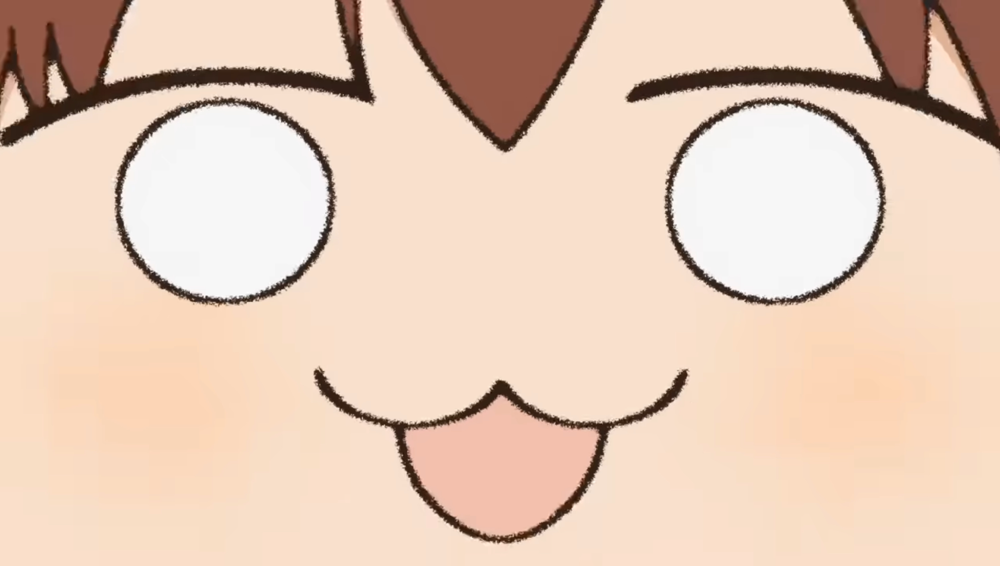

# Noko-Bot




## Project Description
Nun! This is a discord bot that will show the hit song "Shikairo Days" only if users send a specific sequence of messages on Discord
(Please note that this is just a personal project and not affiliated with the offical show or song)

## Project Installation
Nun! You should install/run the following:

node.js
```
npm install discord.js

npm install -g nodemon
OR 
sudo npm install -g nodemon (for mac)

npm install dotenv
```


## Run The Project
Nun! To run the project you can either do:

```
nodemon
```
Note: check this if nodemon not working: [nodemon not work fix](https://stackoverflow.com/questions/63423584/how-to-fix-error-nodemon-ps1-cannot-be-loaded-because-running-scripts-is-disabl)

or

```
src/index.js
```

Once the project is running, in Discord you must do the following to have Noko Bot summon the video:

Note: Do not include "message 1" or "message 2" in your discord message when summoning Noko Bot. Otherwise Noko Bot won't register the messages!

```
message 1: shikanoko nokonoko koshitantan

message 2: :clap: (note: the clap emoji must be a separate message)
```

OR 

```
message 1: しかのこのこのここしたんたん

message 2: :clap:
```

OR 

```
message 1: shikanoko nokonoko koshitantan :clap:
```

OR

```
message 1: しかのこのこのここしたんたん :clap:
```


You can also type phrase out in chunks
(ex. msg1 -> shikanoko, msg2 -> nokonoko,  msg3 -> koshitantan, msg4 -> :clap:)

Say しかのこのこのここしたんたん (can be in english too!) , followed by the clap in a new message ***4 times*** and Noko Bot will show you the video! 

You can also see how many times Noko Bot had been called with the sequence of messages describe above by typing the message:
```
!shikanoko'd
```


